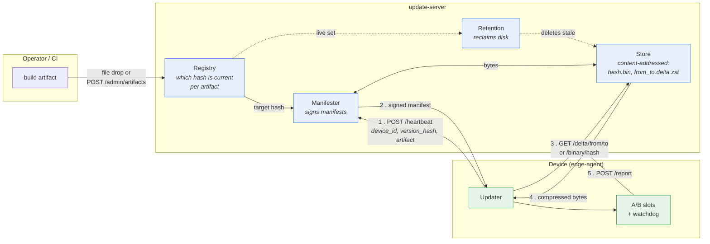

# OTA Updater

A Go library and server for **over-the-air updates on constrained networks** —
built for NB-IoT links at 20–60 kbps with high latency and frequent
disconnects, where a naive "download the new binary" strategy is not viable.

```sh
go get github.com/carlosprados/ota-updater
```

Apache-2.0. Both halves are importable Go packages, not just binaries.

## What it actually gives you

| | |
|---|---|
| **Binary deltas** | `bsdiff` + `zstd`. Ship a patch instead of the whole binary — usually one to two orders of magnitude less downlink. |
| **Signed everything** | Ed25519 over `(target hash, transferred bytes hash)`. The agent rejects a corrupt payload *after downloading it but before patching*, which on NB-IoT is the save that matters. |
| **A/B slots + rollback** | The new binary is staged in the inactive slot. A watchdog confirms health after the swap; a version that fails to come up twice is marked bad permanently. |
| **Multi-artifact** | One server, N components × M versions × K architectures. Content-addressed storage means two tracks shipping identical bytes share one file. |
| **Never strands a device** | If the server cannot build a patch — factory-flashed unit, sideloaded build, corrupt slot — it ships the whole compressed target instead. |
| **Bounded resources** | RAM is capped by explicit byte budgets regardless of history size or artifact count. Disk is reclaimed by a retention sweeper. |
| **Two transports** | HTTP/JSON and CoAP/CBOR, mirroring the same resource paths. The agent falls back between them once per cycle. |

## The shape of the system



The division of labour is worth stating plainly, because it is the design
decision everything else follows from:

- The **Store** knows bytes and nothing else. It is addressed purely by
  SHA-256 and has no concept of "current", "version", or "artifact".
- The **Registry** knows which bytes are current for which publication track.
  It is the *only* per-artifact state in the system.

That split is why one server handles N components × M versions ×
K architectures without duplicating storage, and why adding an artifact costs
bookkeeping rather than disk.

## Where to go next

{}

## Status

Feature-complete: both binaries build static (`CGO_ENABLED=0`), the unit suite
runs green under `-race`, and an end-to-end integration test drives a real
agent against a real in-process server through a full update cycle.

Known gaps are documented honestly in
[Known limitations]({}) — including the
ones deliberately deferred.
