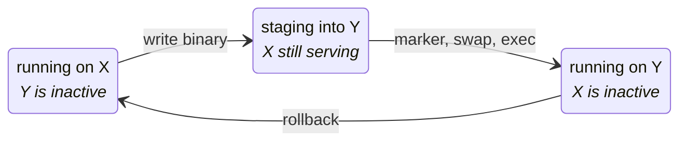
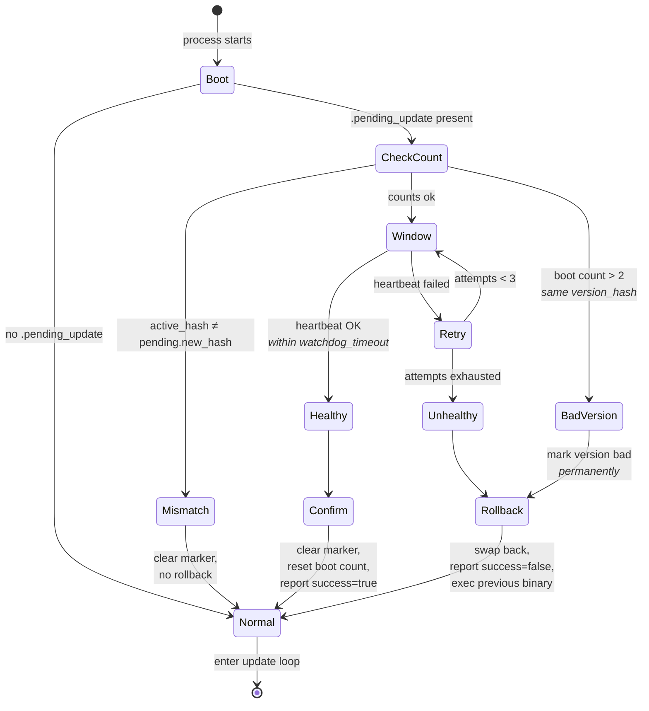
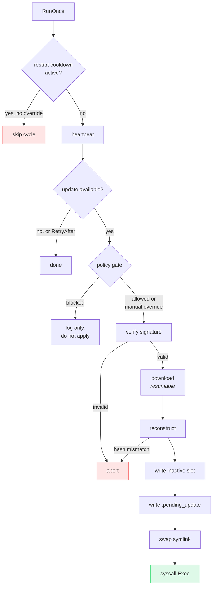

## A/B slots

The device keeps two slot files and a symlink. Updates are written to the
**inactive** slot; the symlink swap is the only atomic moment.



The two slots are symmetric, so the cycle is drawn once with `X` and `Y`
standing for whichever of A/B is currently active: the next update runs the
same three steps with the roles exchanged. The active slot is never written
to while staging, which is why a crash during the download costs nothing but
the download.

The ordering is chosen so that **every** crash point is recoverable:

| Crash between… | Next boot sees | Action |
|---|---|---|
| staging and `.pending_update` | no marker | nothing happened; retry next cycle |
| `.pending_update` and symlink swap | marker, but `active_hash ≠ pending.new_hash` | clear the marker, no rollback |
| symlink swap and exec | marker matching active hash | run the watchdog window normally |

## Boot phase and watchdog

After the swap, the freshly-exec'd binary has to prove it works.



Two numbers, both deliberate:

- **Three heartbeat attempts** inside `watchdog_timeout`, not one. A single
  failed heartbeat on NB-IoT means almost nothing — transient loss is the
  normal condition of the link, and rolling back on it would produce far more
  spurious rollbacks than genuine ones.
- **Boot count > 2** marks a version bad *permanently*. A binary that starts,
  crashes, and starts again twice is not going to succeed on the third try;
  continuing would be a boot loop rather than a recovery.

The health check is a pluggable `HealthChecker` interface. The default is
"a heartbeat to the server succeeded", which is a reasonable proxy for "the
network stack and the process both work" — but an embedder that knows what
*its* application healthy means should replace it.

## The update loop



### Jitter

`check_interval` is spread by ±`jitter` (default ±30%) on every cycle. A fleet
flashed and deployed on the same day would otherwise heartbeat in lock-step
forever, turning an hourly cadence into an hourly thundering herd against the
server.

### Update policy

The agent compares its own baked-in version (injected via
`-ldflags "-X main.version=..."`) against `TargetVersion`:

```yaml
update:
  auto_update: true              # master switch
  max_bump: major                # none | patch | minor | major
  unknown_version_policy: deny   # deny | allow, for non-semver labels
```

Two equivalent one-shot manual overrides bypass the gate for exactly one
cycle — a sidecar file for operators and a method for embedders:

```sh
touch /opt/agent/slots/.update_now
```

```go
updater.TriggerUpdate()
```

## CoAP tuning

Every key under `server.coap` is applied to each connection the agent opens,
for both the heartbeat/report leg and the delta download leg. They share one
`CoAPOptions` value precisely so the two legs of a single update cycle cannot
end up tuned differently on the same link.

```yaml
server:
  coap:
    block_size: 512          # RFC 7959 Block2 size: power of 2, 16..1024
    ack_timeout: "60s"       # window before retransmitting a confirmable message
    max_retransmits: 4       # RFC 7252 MAX_RETRANSMIT
    keepalive: "2m"          # 0 disables
    dial_timeout: "30s"      # socket setup; over UDP this is name resolution
```

Leaving a key at 0 keeps go-coap's default, and those defaults assume an
ordinary network: a 3 s dial, a 2 s ACK window, 4 retransmits. On a link with
multi-second round trips they give up long before the peer had a chance to
answer, which is the whole reason these knobs exist.

Two notes worth internalising:

- **`dial_timeout` is not a connection timeout.** UDP has no handshake, so
  what it actually bounds is name resolution. It matters when DNS is slow or
  unreachable, which on NB-IoT is common.
- **Smaller `block_size` survives loss better and costs round trips.** 512 is
  a reasonable default: small enough to avoid IP fragmentation on most paths,
  large enough that a 100 KiB transfer is not 6400 exchanges. An unsupported
  value falls back to the library default rather than failing the transfer —
  a mistyped config should not brick updates.

{}
Before v0.4.0 every one of these keys was parsed and then discarded: all three
CoAP dials were made with no options at all, and `ack_timeout` was
additionally passed into a dial-timeout slot that itself went unread. If you
configured this block against an earlier release, it had no effect.
{}

## Self-restart

The default `RestartStrategy` is `syscall.Exec`, which **replaces the process
image in place**. That preserves the PID, cgroup, environment and file
descriptors, which in turn makes it transparent to service managers:

- **systemd** — works with any `Type=`, including `notify` (re-send
  `sd_notify(READY=1)` after exec). Point `ExecStart=` at the *symlink*, not a
  slot file, so it stays stable across swaps.
- **Docker** — PID 1 does not change, so the container is not restarted. The
  A/B slots must live on a **persistent volume**, or an update evaporates on
  the next container recreate.

`ExitRestart` is shipped as an alternative for environments that would rather
have the supervisor relaunch the process.

If a restart *fails*, a cooldown is persisted to disk (default 1h) and
subsequent cycles short-circuit. A failed restart is almost always structural
— a bad binary, a missing interpreter, a permissions problem — and retrying it
in a tight loop only fills the logs. Manual triggers skip and clear the
cooldown.

## Embedding as a library

The agent is designed to be embedded, not just run. No globals, injectable
logger, pluggable `HealthChecker`, `RestartStrategy` and `HWInfoFunc`.

```go
import (
    "github.com/carlosprados/ota-updater/pkg/agent"
    "github.com/carlosprados/ota-updater/pkg/crypto"
)

pub, _ := crypto.LoadPublicKey("/etc/myapp/agent.pub")
slots, _ := agent.NewSlotManager("/var/lib/myapp/slots", "/var/lib/myapp/current", logger)
bootCnt, _ := agent.NewBootCounter("/var/lib/myapp/slots/.boot_count")

client := &agent.HTTPClient{BaseURL: "https://update.example.com", HTTP: httpClient}
pair, _ := agent.NewClientPair(client, &agent.HTTPTransport{HTTP: httpClient})

watchdog, _ := agent.NewWatchdog(bootCnt, healthChecker, agent.WatchdogConfig{
    Timeout: 60 * time.Second, Retries: 3, MaxBoots: 2,
}, logger)

updater, _ := agent.NewUpdater(agent.UpdaterDeps{
    Config: agent.UpdaterConfig{
        DeviceID: deviceID,
        Artifact: "myapp/linux/arm64",
        Version:  buildVersion,
        StateDir: "/var/lib/myapp",
    },
    Primary:   pair,
    Slots:     slots,
    PublicKey: pub,
    Watchdog:  watchdog,
    Restart:   agent.ExecRestart{},
    Logger:    logger,
})

if err := updater.BootPhase(ctx); err != nil { /* ... */ }
go updater.Run(ctx)
```

### Driving the slots directly

`SlotManager` is public surface, and `Swap` and `Rollback` are **toggles**:
each activates whichever slot is currently inactive, asserting nothing about
what that slot contains. Called twice, `Rollback` flips forward again — into
the binary that just failed.

The `Updater` is safe because it verifies the reconstructed binary before
swapping and pairs the call with the `.pending_update` marker, so every crash
point is recoverable. A consumer driving `SlotManager` on its own schedule
gets neither guarantee, so prefer the checked variants:

```go
// Refuses unless the inactive slot really holds the bytes you expect.
if err := slots.SwapTo(targetHash); err != nil { /* ... */ }
if err := slots.RollbackTo(previousHash); err != nil { /* ... */ }
```

These turn the toggle into an assertion about where the device ends up: a
double call, or a slot holding something unexpected, fails loudly instead of
silently activating the wrong binary.

`NewSlotManager` also verifies the provisioned layout — both slot files and
the active symlink — and fails at construction. A provisioning fault is then
a clear startup error rather than a confusing failure on the first update
cycle, potentially hours later on a device in the field.

{}
An `Updater` follows exactly one artifact. An embedder managing several
components runs one `Updater` per component: they can share a
`ProtocolClient`, but each needs its own slots directory and state directory.
{}

`cmd/edge-agent/main.go` is a ~190-line reference wrapper around exactly this
API — there is no private path it uses that an embedder cannot.
