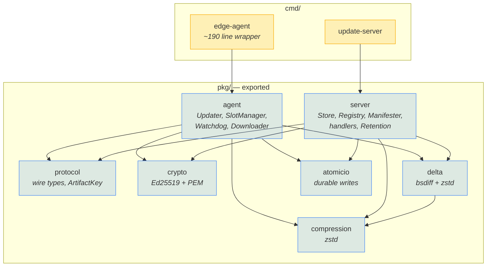
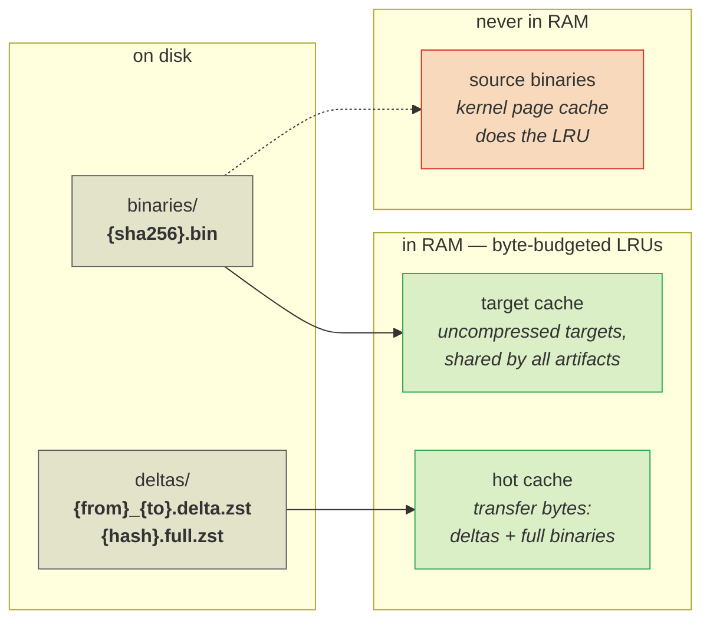
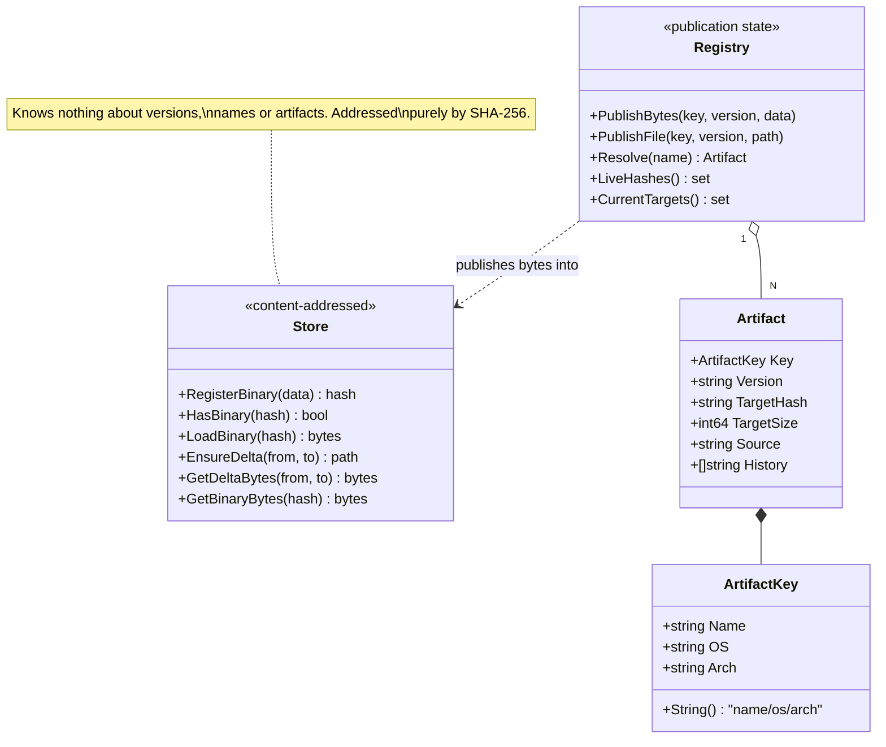
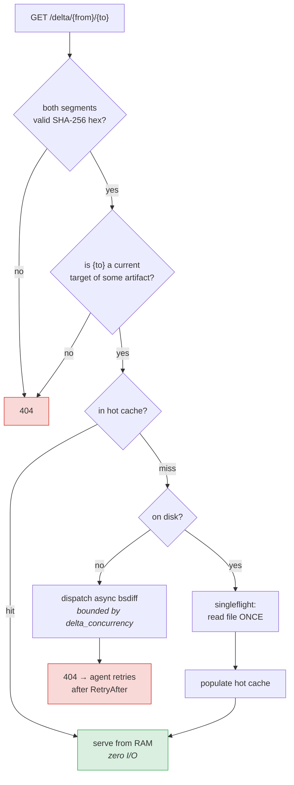
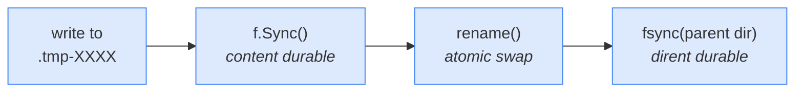

## Package layout

Everything under `pkg/` is exported and importable. There is no `internal/`
directory: the server is a library that also ships a binary, not a binary with
some code hidden inside it.

`protocol` is the only package both sides depend on for wire compatibility.
Its structs carry **dual JSON and CBOR tags**, so one type serializes over
HTTP (JSON) and CoAP (CBOR) with no duplication and no risk of the two
representations drifting apart.

## The store is content-addressed

This is the load-bearing decision. Nothing in the store is keyed by version,
name, or artifact — only by SHA-256 of content.

Three consequences follow directly:

1. **Two artifacts shipping identical bytes share one file.** Publishing the
   same build on `agent/linux/arm64` and `agent/linux/amd64` costs one
   `.bin`, not two.
2. **A delta is identified by its `(from, to)` pair alone**, regardless of
   which artifact asked for it. The delta endpoint therefore needed no
   artifact segment when multi-artifact support was added.
3. **Deduplication is free and automatic.** Re-publishing an unchanged build
   is a no-op: same hash, same file, no cache invalidation, and no device
   sees a spurious update.

## Bytes vs bookkeeping

The `Registry` is the only component that knows what "current" means. It
persists to a JSON state file, because a server that forgets which version is
current after a restart is not a source of truth for a fleet — it is an
outage.

`History` exists for retention: a superseded target is still a plausible delta
source for a device that has not checked in yet, so the sweeper must not
collect it.

## Request path for a transfer

Concurrent requests for the same uncached artifact collapse through
`singleflight`, so a campaign burst — thousands of devices asking for the same
delta within seconds of each other — becomes **one** disk read or **one**
bsdiff run, not thousands.

The "is `{to}` a current target" check is not cosmetic. Without it, anyone able
to name two known hashes could ask an unauthenticated endpoint to run an
arbitrary `bsdiff` — the most expensive operation the process performs, at
roughly 20× the binary size in peak RAM. Restricting the destination bounds
what a request can make the server do.

## Durability

Every write that must survive power loss goes through `pkg/atomicio`, which
guarantees the same three steps in order:

The final `fsync` of the parent directory is the step most implementations
skip. Without it, a rename can be lost across a power cut even though the file
contents were synced — the classic "the file is there but empty, or not there
at all" failure on unclean shutdown.

Callers unified behind it: the store's binaries and deltas, the agent's slot
writes and symlink swap, the pending-update marker, the boot counter, the
download resume state, and the registry state file.

A crash between `create` and `rename` leaves a `.tmp-*` file behind; both the
store and the agent sweep stragglers older than 24h at startup.
