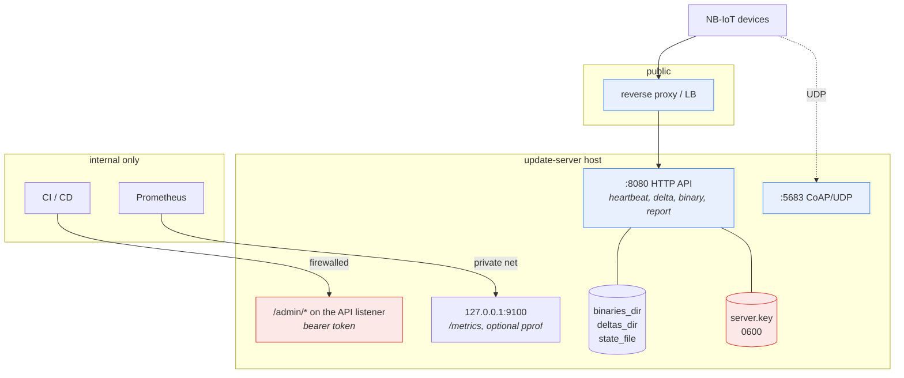
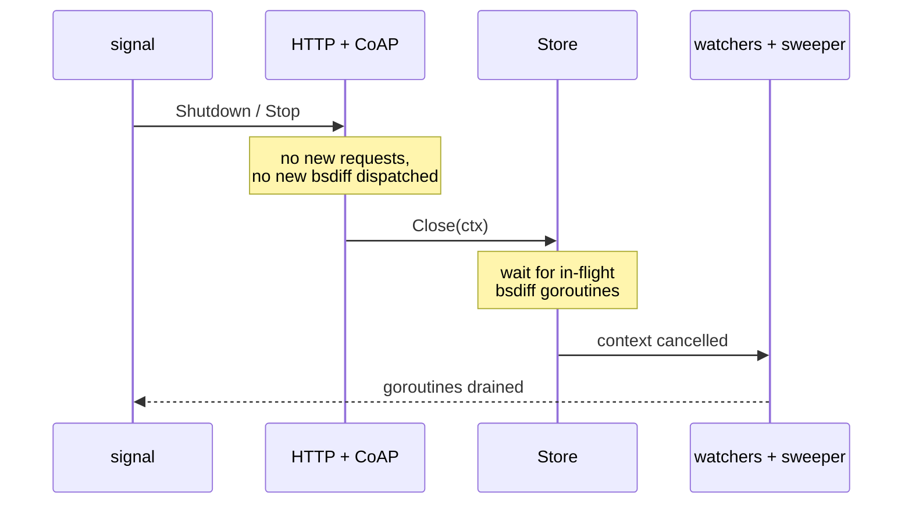

# Operations

## Deployment shape



Three boundaries that must not blur:

1. **`/admin/*` is not public.** It shares the API listener for convenience,
   so firewall it, or terminate it behind a proxy ACL. The bearer token is a
   second line of defence, not the first.
2. **`/metrics` and `/debug/pprof` have no authentication.** They bind to a
   separate listener defaulting to loopback for exactly that reason. pprof
   exposes process internals and is off by default; the server logs a WARN at
   startup if you enable it.
3. **`server.key` never leaves the host.** Back it up offline. Losing it means
   you can no longer issue updates to any device already trusting the matching
   public key.

## Graceful shutdown

`SIGINT`/`SIGTERM` triggers an ordered drain, all bounded by
`http.shutdown_timeout`:



`bsdiff` is **not** context-cancellable. If a generation is still running when
the deadline expires, the server logs it and exits; the worst outcome is an
orphaned `.tmp-*` file, swept on the next boot.

## Observability

```yaml
metrics:
  addr: "127.0.0.1:9100"
  pprof_enabled: false
```

Metrics use an isolated registry per server instance — not
`prometheus.DefaultRegisterer` — so tests and embedders never collide.

### The five that matter most

| Metric | Watch for |
|---|---|
| `updater_deltas_served_total{mode="full"}` vs `{mode="delta"}` | A rising **full** share means retention is evicting source binaries the fleet still needs. Raise `history_depth`. |
| `updater_deltas_served_total{hot_hit="miss"}` | A high miss rate means `hot_delta_cache_mb` is too small for your campaign size. |
| `updater_async_generations_inflight` | Sustained at `delta_concurrency` means bsdiff is the bottleneck. |
| `updater_admin_rate_limited_total` | Non-zero at steady state means someone is hammering the admin port. |
| `updater_signature_failures_total` | Should be **exactly zero**. Anything else is a broken key or a broken build. |

Plus the retention family (`updater_retention_sweeps_total`,
`..._deleted_files_total{kind}`, `..._reclaimed_bytes_total`), the artifact
gauges (`updater_artifacts`, `updater_artifact_target_size_bytes{artifact}`),
and cache occupancy.

Label cardinality is bounded by design: `code` collapses to `2xx`/`4xx`/`5xx`
plus explicit `Unauthorized`/`Forbidden`/`Too Many Requests`, and `artifact`
is bounded by the number of registered tracks rather than by traffic.

## Structured logging

`log/slog`, with the level changeable at runtime:

```sh
curl -X POST -H "Authorization: Bearer $ADMIN_TOKEN" \
  -d '{"level":"debug"}' https://update.example.com/admin/loglevel
```

Mandatory fields, so logs are greppable across a fleet:

- Server: `op`, `device_id`, `artifact`, `from`, `to`, `remote`
- Agent: `op`, `device_id`, `version_hash`, `artifact`

## Device-side memory limits

Go's GC is not aware of a cgroup limit unless told. Set **both**:

```ini
# systemd
[Service]
Environment=GOMEMLIMIT=80MiB
MemoryMax=100M
```

```yaml
# docker-compose
services:
  agent:
    environment: { GOMEMLIMIT: "80MiB" }
    mem_limit: 100m
```

`GOMEMLIMIT` is a **soft** limit: the GC gets aggressive as it approaches,
trading CPU for memory. `MemoryMax` / `--memory` is a **hard** cgroup limit
enforced by the OOM killer. The recommended 80/20 split gives the GC room to
react before the kernel intervenes — with only the hard limit, the process is
killed instead of collecting.

## Disk space

Both sides warn at startup when free space is low:

```yaml
store:
  disk_space_min_free_pct: 10
  disk_space_min_free_mb: 100
```

Warnings only, never fatal — a freshly provisioned filesystem may legitimately
start near full, and refusing to boot over it would be worse than the problem.

On the agent, a download hitting `ENOSPC` applies a 5-minute backoff floor
instead of burning its retry budget against a condition that will not change
on its own.

## Checklist for unattended operation

- [ ] `admin.token` from `openssl rand -hex 16`, admin port firewalled
- [ ] `server.key` mode `0600`, backed up offline
- [ ] `store.state_file` configured and on persistent storage
- [ ] `retention.enabled: true` with a `history_depth` matching how far behind
      your slowest devices get
- [ ] `/metrics` scraped; alert on `signature_failures_total > 0`
- [ ] Agent slots on a persistent volume (Docker) and `ExecStart=` pointing at
      the symlink (systemd)
- [ ] `GOMEMLIMIT` + hard cgroup limit on the device
- [ ] `update.jitter` left at its default for fleets above a few dozen devices
