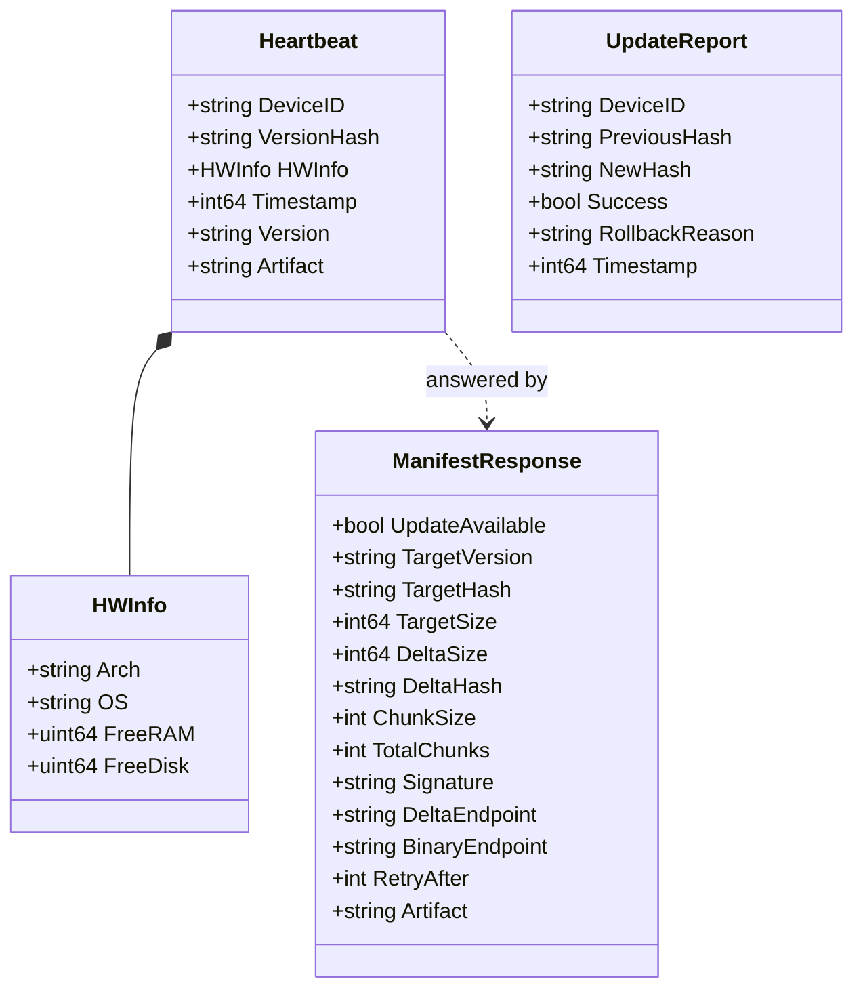
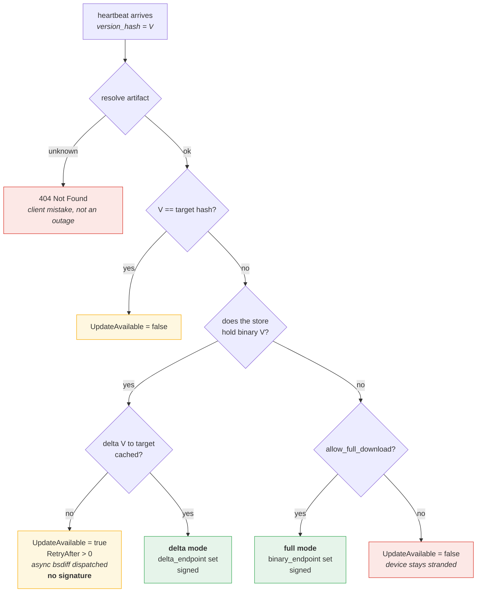
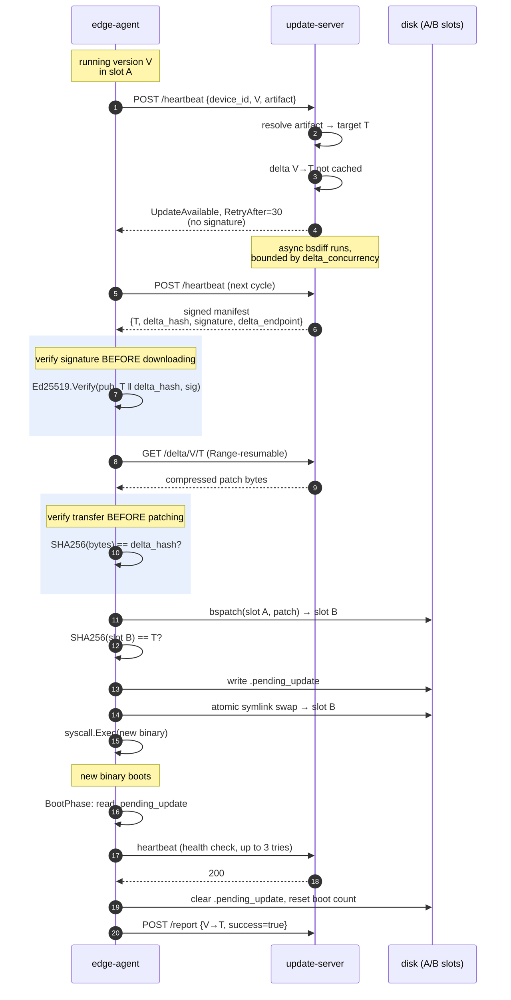
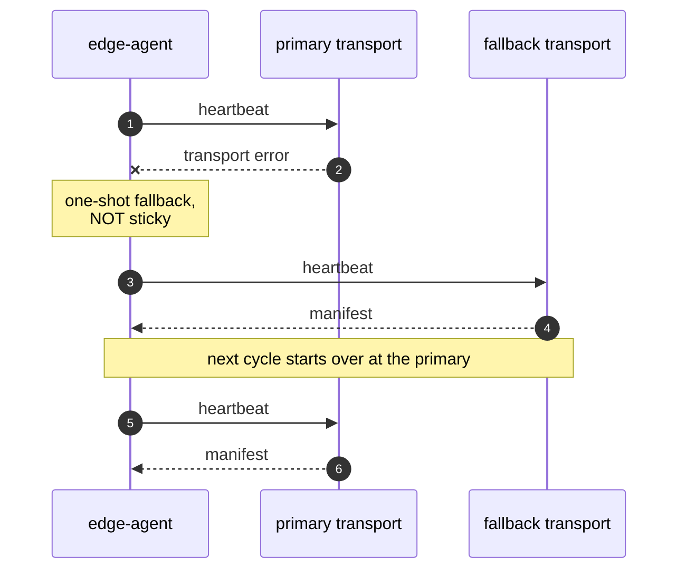

# Protocol

## Resource paths

HTTP and CoAP mirror each other exactly — both handlers read their paths from
the same constants in `pkg/protocol`, so they cannot drift.

| Path | Method | HTTP body | CoAP body |
|---|---|---|---|
| `/heartbeat` | POST | JSON `Heartbeat` → `ManifestResponse` | CBOR |
| `/delta/{from}/{to}` | GET | compressed patch, Range-capable | Block2 |
| `/binary/{hash}` | GET | whole compressed target, Range-capable | Block2 |
| `/report` | POST | JSON `UpdateReport` | CBOR |
| `/health` | GET | JSON status + artifact map | — |

Admin endpoints (`/admin/*`) are HTTP-only and Bearer-authenticated.

## Messages

One Go type per message, carrying **both** JSON and CBOR tags. CBOR uses
integer keys (`cbor:"N,keyasint"`) rather than strings, which matters on
NB-IoT: field names would otherwise be a meaningful fraction of a heartbeat.

Two fields deserve explanation:

- **`Heartbeat.Artifact`** names the publication track, as
  `"name/os/arch"` or just `"name"`. **Empty means "the server's default
  artifact"**, which is what keeps single-artifact deployments — and agents
  built before multi-artifact support existed — working with no change.
- **`ManifestResponse.DeltaHash`** is the hash of *the bytes that travel on
  the wire*, whichever mode is in play. The name predates the full-download
  mode; the semantics are "transfer hash".

## Two transfer modes

Exactly one endpoint field is set on an actionable response, and it selects
how the agent reconstructs the target.

The right-hand branch is the one that did not exist originally. A device whose
current binary the server has never seen — factory-flashed, sideloaded, or a
version whose source binary aged out of retention — used to receive
`UpdateAvailable=false` on **every** heartbeat, forever. That is a silent,
permanent strand that looks like a healthy fleet in the logs.

See [Full-download fallback]({}) for why
the signature scheme did not have to change to accommodate it.

## A complete update cycle

### Why the verification order is not negotiable

Three checks, each catching something the others cannot:

| Step | Catches | Cost if it fires |
|---|---|---|
| Verify signature **before** download | A tampered or forged manifest | Zero bytes transferred |
| Verify transfer hash **before** patching | A corrupt or substituted payload | Bytes wasted, but no CPU — **the NB-IoT save** |
| Verify reconstruction **before** swap | Local disk corruption, bspatch bugs, a flipped transfer mode | CPU wasted, but no bad binary activated |

The middle one is the reason the signature covers the transfer hash at all.
On a 20 kbps link a 2 MiB payload is thirteen minutes of radio time; finding
out it was corrupt *after* also spending the CPU and RAM of a `bspatch` would
be strictly worse.

## Failure and retry

The fallback is deliberately **not sticky**: a cycle that failed over to CoAP
returns to HTTP on the next tick. A transient failure should not permanently
demote the preferred transport, and a persistent one costs only one extra
attempt per cycle to rediscover.

Downloads retry with exponential backoff and jitter, resuming via HTTP `Range`
from the last verified offset. Two special cases short-circuit the normal
backoff:

- **Disk full** (`ENOSPC`) applies a 5-minute floor. Burning retries against a
  static condition helps nobody.
- **A failed restart** arms a persisted cooldown (default 1h), because a
  restart that fails is almost always structural rather than transient.
