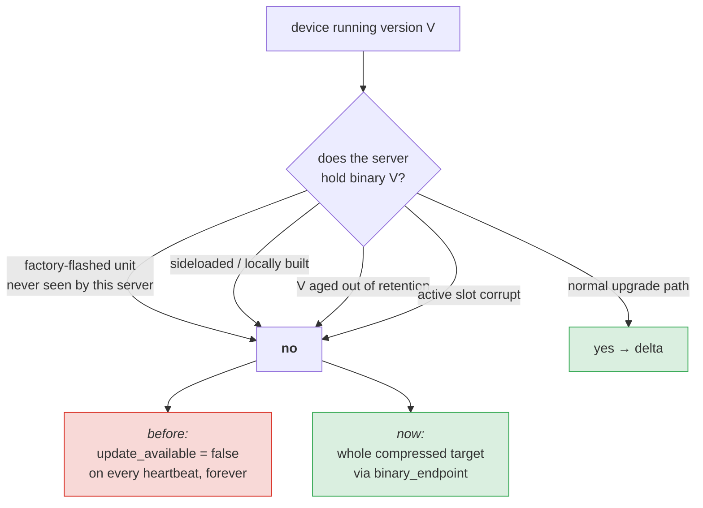
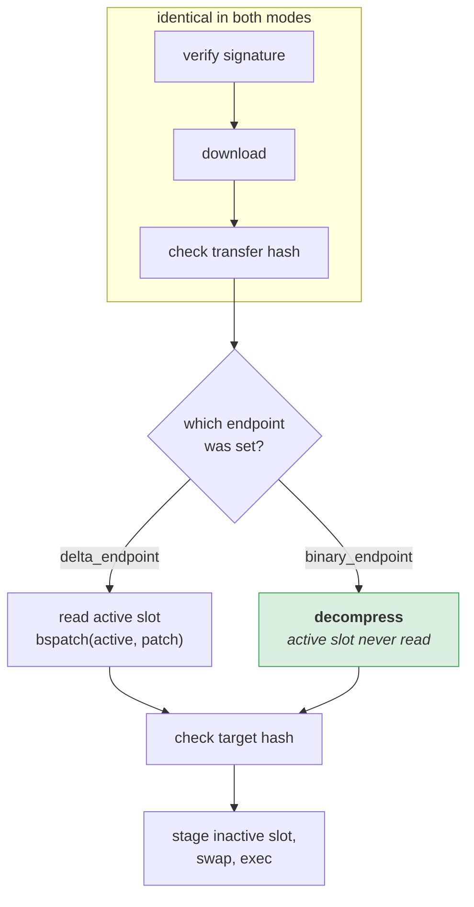

## The failure it fixes

Delta updates have a hard precondition: **the server must still hold the exact
bytes the device is running.** Without them there is nothing to diff against.

That precondition fails for entirely ordinary devices:



The old behaviour is worth dwelling on, because of *how* it failed. The device
kept heartbeating. The server kept answering `200 OK`. Nothing errored,
nothing alerted, no metric moved. The fleet looked healthy while a subset of
it could never be updated again — including, by construction, the devices most
likely to need it.

## How the agent handles it

The two modes differ in exactly one step:



That "active slot never read" is not incidental. It means the full-download
path also recovers a device whose current binary is **corrupt** — the one case
where patching could not work even if the server did have the source bytes.

## Cost

A full transfer is larger than a patch, often by one to two orders of
magnitude. On a 20 kbps NB-IoT link that is the difference between roughly one
minute and roughly thirteen. It is the fallback, not the default — but a slow
update beats no update.

Both the patch and the full binary are zstd-compressed, so the comparison is
compressed-vs-compressed rather than patch-vs-raw.

## Watching for it

```
updater_deltas_served_total{mode="full"}
updater_deltas_served_total{mode="delta"}
```

A **rising full/delta ratio** is the signal that retention is evicting source
binaries your fleet still needs. The fix is to raise
`retention.history_depth`, not to disable the fallback.

A steady trickle of `mode="full"` is normal and healthy: it is new devices
joining the fleet for the first time.

## Turning it off

```yaml
manifest:
  allow_full_download: false
```

This restores the old behaviour, stranding any device the server cannot diff
against. It is only defensible when downlink is so scarce that a full transfer
is never acceptable **and** you have an out-of-band process for stranded
devices. If you set this, make sure something is watching
`heartbeat` logs for repeated unknown-source warnings — otherwise you are back
to a silent failure.
