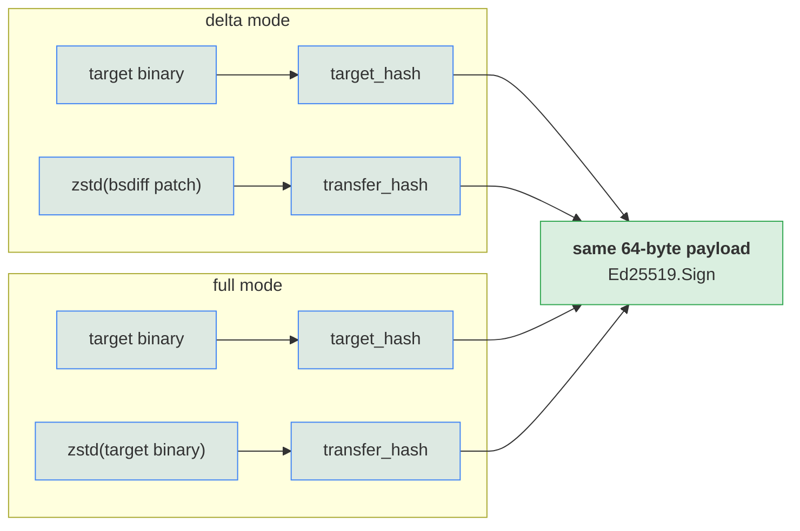
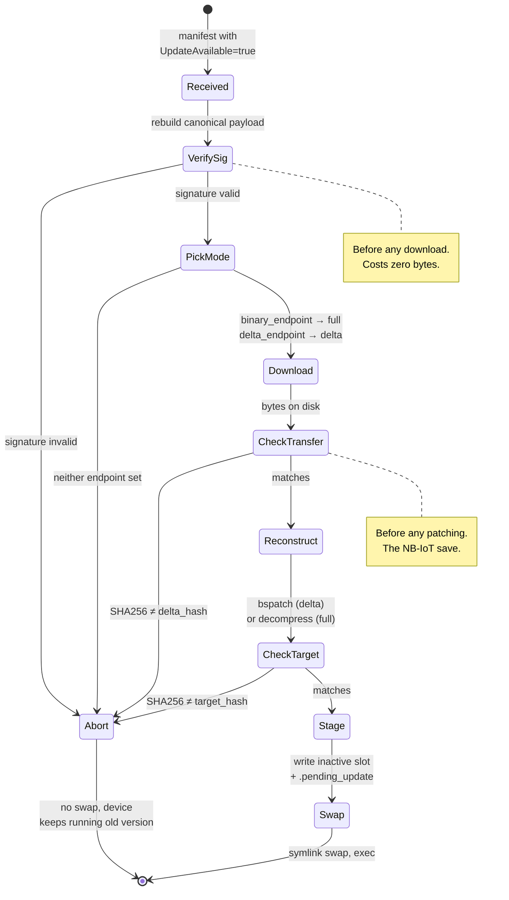
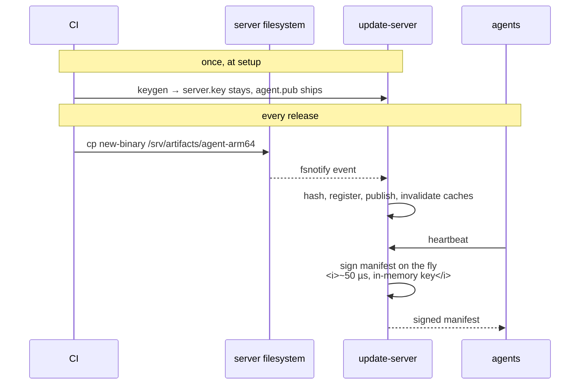

{}
`docs/signing.md` in the repository is the normative document. This page is a
readable companion; if the two ever disagree, the repository wins.
{}

## What is signed

```
payload   = target_hash_raw ‖ transfer_hash_raw     // 32 + 32 = 64 bytes
signature = Ed25519.Sign(server_private_key, payload)
```

- **`target_hash_raw`** — raw SHA-256 of the *reconstructed target binary*,
  i.e. exactly what will run on the device afterwards.
- **`transfer_hash_raw`** — raw SHA-256 of *the bytes that travel on the
  wire*. No other transformation.

Strict byte-wise concatenation, target first. **No separators, no length
prefix, no version byte** — both halves are the same algorithm at the same
fixed length, so there is no ambiguity to resolve.

The payload is **not** re-hashed before signing: Ed25519 hashes the message
internally with SHA-512, so an outer SHA-256 would be a redundant layer that
only adds a place for implementations to disagree.

## One scheme, two modes

This is the part worth understanding, because it is why adding whole-binary
downloads required no cryptographic change at all.



Because `transfer_hash` was defined from the start as "the hash of whatever
bytes are transferred" rather than "the hash of the patch", a full download is
formally just *a delta from nothing*.

{}
It is not only a bandwidth choice. If the target were served raw, then
`transfer_hash == target_hash` and the signed payload would degenerate to
`H ‖ H` — a distinguishable, weaker special case that every implementation
would then have to handle separately. Compressing keeps the two halves
independent and the scheme uniform.
{}

## Verification order on the agent



Every abort path leaves the device running its current binary. There is no
state in which a failed update degrades what was already working.

## Threat model

| Attack | Outcome |
|---|---|
| MitM forges or tampers with the manifest | Rejected at signature verification. Nothing downloaded. |
| MitM tampers with the transferred payload | Rejected at the transfer-hash check, before any CPU is spent patching. |
| MitM flips the transfer mode (swaps which endpoint field is set) | The mode is **not** signed — but the flip cannot produce a valid binary. The agent either bspatches a compressed binary or treats a patch as one; the result fails the authenticated `target_hash` check and the swap never happens. Cost: one wasted download. |
| MitM replays an older signed manifest | **Possible.** The agent will apply an old-but-validly-signed transfer. Mitigation, if it becomes a concern, is a monotonic counter in the signed payload. Documented rather than hidden. |
| Compromise of `server.key` | Total. The attacker can sign anything for any target. Mitigation is operational: isolated host, offline backup, no unrelated services on the box. |

## Keys

| | Format | Mode | Lives on |
|---|---|---|---|
| `server.key` | PKCS#8 DER in PEM | `0600` | Update server only. Never leaves it. |
| `agent.pub` | PKIX DER in PEM | `0644` | Shipped with the agent binary or embedded in firmware. |

```sh
go run ./tools/keygen -out ./keys
```

`keygen` refuses to overwrite existing files (`O_EXCL`). Destroying a keypair
has to be a deliberate, manual act — losing `server.key` means you can no
longer issue updates to any device that already trusts the matching public
key.

## Operator workflow

Signing is **not** a release step. There is no command to run, no artifact to
sign offline, no key to feed into CI.



Signatures are never cached on disk. Ed25519 signing is sub-millisecond, and
always rebuilding removes a whole class of staleness bugs — a signature
cached against a stale transfer hash is exactly the kind of defect that
survives testing and surfaces in the field.
