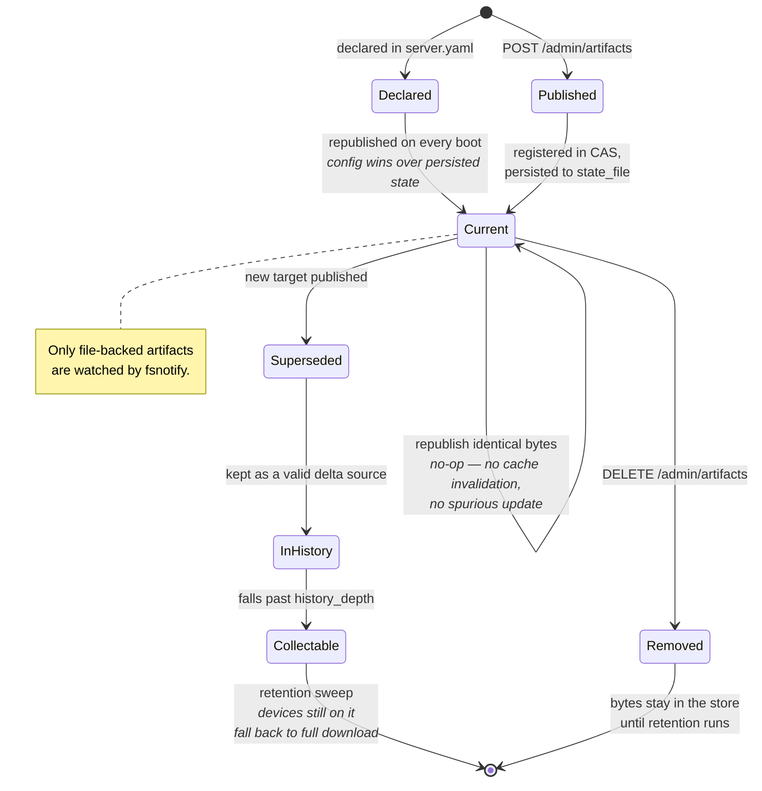
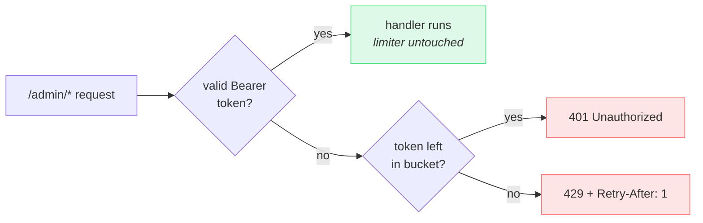
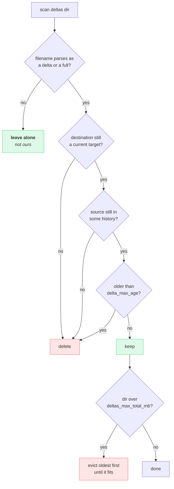
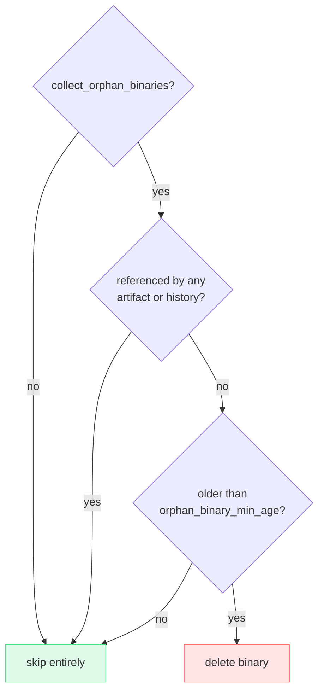

## Artifacts

An **artifact** is a publication track identified by a `(name, os, arch)`
triple. The server holds exactly one current target per track.

```
keystone-agent/linux/arm64     ← one track
keystone-agent/linux/amd64     ← different track, its own target
keystone-proxy/linux/arm64     ← another component entirely
tariff-table                   ← platform-independent: no os/arch
```

`os` and `arch` are optional but **coupled**: set both or neither. A
half-specified platform is always a caller bug, and accepting it would create
two keys that a human reads as the same artifact.

The charset is deliberately narrow — `[A-Za-z0-9._-]` for names, `[a-z0-9]`
for platform tokens, with `.` and `..` rejected outright. Keys reach HTTP
request paths, retention bookkeeping and structured log fields, so anything
that could read as a path segment, a traversal, or a log-injection newline is
rejected at the boundary rather than escaped at each use site.

### Lifecycle



The distinction between **declared** and **published** matters operationally:
config is authoritative for the tracks it names and re-publishes them on every
boot, so an operator editing YAML always wins. Tracks created only through the
API are untouched by config and survive restarts via `store.state_file`.

{}
Without `store.state_file`, everything published through `POST
/admin/artifacts` is lost on restart. For a server that is the source of truth
for a fleet, that is data loss, not a cache miss.
{}

### Configuration

```yaml
artifacts:
  - name: "keystone-agent"
    os: "linux"
    arch: "arm64"
    version: "1.4.2"
    binary: "/srv/artifacts/keystone-agent-linux-arm64"
  - name: "keystone-agent"
    os: "linux"
    arch: "amd64"
    version: "1.4.2"
    binary: "/srv/artifacts/keystone-agent-linux-amd64"

default_artifact: "keystone-agent/linux/arm64"
```

`default_artifact` answers heartbeats that name no artifact. It is required
once more than one track exists, and inferred when there is exactly one.

The legacy single-target form still works verbatim and folds into one track
named `default`:

```yaml
target:
  version: "1.0.0"
  binary: "./store/binaries/latest"
```

## Admin control plane

Static Bearer token, compared in constant time. The server rejects any token
shorter than 32 characters at config load — roughly 128 bits of entropy for
random hex or base64.

```sh
openssl rand -hex 16
```

| Endpoint | Purpose |
|---|---|
| `POST /admin/reload` | Re-read file-backed artifacts. Empty body = all; `{"artifact":"key"}` = one. |
| `GET /admin/artifacts` | List every track and the current default. |
| `POST /admin/artifacts` | Publish or update a track from a server-side path. |
| `DELETE /admin/artifacts?artifact=key` | Retire a track. |
| `POST /admin/default` | Choose the track for unnamed heartbeats. |
| `POST /admin/gc` | Run a retention sweep now. |
| `POST /admin/loglevel` | Change verbosity at runtime. |

A per-component CI pipeline should always use the **targeted** reload, so
deploying one service never republishes the others:

```sh
curl -X POST -H "Authorization: Bearer $ADMIN_TOKEN" \
  -H "Content-Type: application/json" \
  -d '{"artifact":"keystone-agent/linux/arm64"}' \
  https://update.example.com/admin/reload
```

### Rate limiting

The token bucket throttles **only authentication failures**. A pipeline
hitting `/admin/reload` with the correct token a thousand times never sees a
429; an attacker flooding wrong tokens does.



{}
The bucket is shared across all sources. A distributed attack from many IPs
saturates the same bucket. Operational mitigation: firewall the admin port to
known sources. Per-IP limiting is a tracked follow-up — see
[Known limitations]({}).
{}

## Retention

Nothing in the store is ever overwritten, so without a sweeper every release
adds a binary plus one delta per source version still in the field. Across
N components × K architectures that growth is multiplicative, and a full
filesystem fails writes mid-campaign.

Retention is **off by default** — silently deleting an operator's binaries is
not a sensible default — and treats two classes of file very differently.



Binaries go through a separate, far more conservative pass — and only when
`collect_orphan_binaries` is set:



| Class | Files | Policy |
|---|---|---|
| **Derived cache** | `{from}_{to}.delta.zst`, `{hash}.full.zst` | Collected aggressively. Deleting one costs CPU to regenerate and nothing else. |
| **Binaries** | `{hash}.bin` | The only copy of something you produced. Collected only with an explicit opt-in, only when unreferenced, and only after a grace period. |

```yaml
retention:
  enabled: true
  interval: "6h"
  history_depth: 10
  delta_max_age: "720h"
  deltas_max_total_mb: 0        # 0 disables
  collect_orphan_binaries: false
  orphan_binary_min_age: "24h"
```

Two properties worth internalising:

- **Collecting a binary never strands a device.** An agent still running it
  falls back to a full download. The cost is downlink, not availability —
  which is exactly why `history_depth` is a tuning knob rather than a
  correctness requirement.
- **The sweeper only touches files it can parse.** Both hash segments are
  validated as SHA-256 hex, so a crafted filename cannot widen what gets
  deleted. Anything unrecognised is left in place and logged at DEBUG.

The `orphan_binary_min_age` grace period guards a specific race:
`RegisterBinary` writes the file before the `Publish` that references it, and
a sweep landing between the two would delete a binary seconds away from
becoming a target.

The first automatic sweep happens one interval **after** startup, never at
boot — a restart loop must not become a delete loop.

## Bounded memory

Resident memory is governed by three knobs and nothing else, regardless of
history size or artifact count.

```yaml
store:
  target_cache_mb: 200
  hot_delta_cache_mb: 512
  delta_concurrency: 2
manifest:
  cache_size: 4096
```

| Item | Bound | Notes |
|---|---|---|
| Delta-target binaries | ≤ `target_cache_mb` | Byte-budget LRU keyed by hash, **shared across all artifacts** — this is what stops N tracks from multiplying resident memory. A target larger than the whole budget is never cached and is re-read from disk per generation. |
| Source binaries | **0** | Never held. The kernel page cache does the LRU, shared with every other reader, without inflating the Go heap. |
| Hot transfer cache | ≤ `hot_delta_cache_mb` | Holds deltas and whole compressed binaries in one budget — they compete for the same scarce resource and serve the same purpose. |
| Signed manifests | ≤ `cache_size` × ~500 B | Entry-count LRU keyed by `(artifact, from, to)`. |
| bsdiff transient | ~20× the larger input | Bounded by `delta_concurrency`. |

### The bsdiff ceiling, and the cap that contains it

`bsdiff` peaks at roughly **21× the larger input**, and it scales linearly.
Measured on two consecutive builds of this project's own server binary:

| Input | Peak RSS | Ratio |
|---|---:|---:|
| 13.6 MB | 296 MiB | 21.7× |
| 27.3 MB | 557 MiB | 20.4× |

Most of that is the suffix array: two index tables, one machine word per input
byte. They are **computed, not file-backed**, so the kernel cannot reclaim
them under pressure the way it can with the page cache. Extrapolating: 50 MB
is ~1 GiB per generation, 100 MB is ~2 GiB — each multiplied by
`delta_concurrency`.

Left alone, that turns artifact growth into an OOM. `delta_max_source_mb`
converts it into a policy instead:

```yaml
store:
  delta_max_source_mb: 32   # 0 disables the cap
```

When either binary of a pair exceeds it, the server **does not diff**. The
manifester serves the whole compressed target instead, so the device still
updates — it spends downlink rather than the server spending RAM. The
decision is taken in the manifester rather than left to the store, because a
store that silently refused would leave the device polling `RetryAfter`
forever, which is the stranding failure the
[full-download fallback]({}) exists to
remove.

Three properties worth knowing:

- **A delta already on disk is always served**, whatever the cap says. The
  memory was spent when it was generated. Lowering the cap never invalidates
  work already done.
- **The cap is enforced in the store too**, not just the manifester, because
  `pkg/server` is importable and a direct consumer must not be able to
  allocate the process to death. `Store.EnsureDelta` returns
  `ErrDeltaTooLarge`.
- **It is never silent.** The server logs a WARN naming the offending binary
  and size, and `updater_deltas_served_total{mode="full"}` rises.

{}
It bounds the absolute cost, not the multiplier. 21× is inherent to bsdiff —
it needs the whole suffix array resident. If your artifacts are heading past
~50 MB, the cap keeps the server alive but every device pays full-download
downlink. That is the point at which a different algorithm, rather than a
bigger limit, is the answer.

`librsync` was benchmarked as a replacement and rejected: on real Go binaries
it produced deltas around 100× larger. `zstd --patch-from` is the live
candidate — see [Known limitations]({}).
{}
