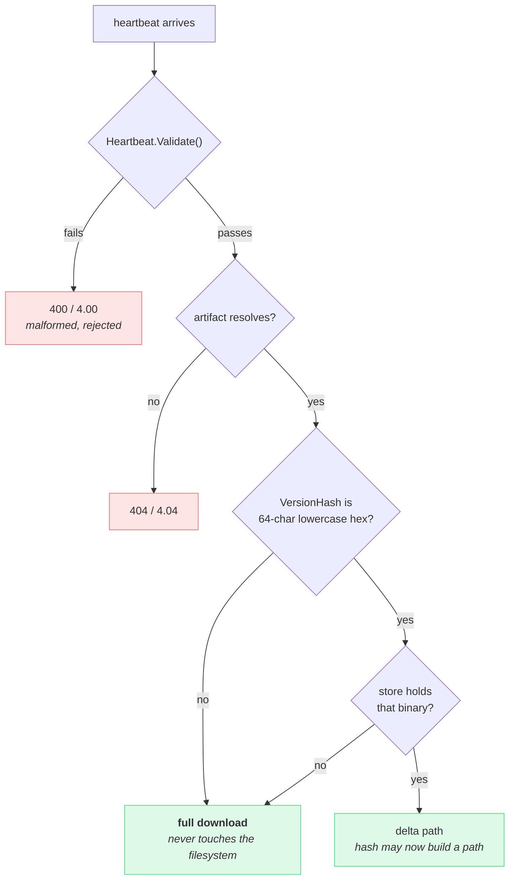

Every field a device sends is attacker-controlled. Over plain CoAP there is no
authentication at all, so a heartbeat costs one UDP packet to forge. The
server's defence is to validate at the boundary and never sanitise at each use
site.

## What is checked, and where it goes

| Field | Bound | Rationale |
|---|---|---|
| `device_id` | required, ≤ 128 bytes, no control characters | Logged on every heartbeat on both transports. Unbounded, it bloats log lines; with a newline in it, a peer forges log records. |
| `version` | ≤ 64 bytes, no control characters | Same reasoning; advisory field. |
| `artifact` | parsed as an `ArtifactKey` | Charset and length come from that type, which already had to be strict because keys reach paths and log fields. |
| `version_hash` | must be 64-char lowercase hex **before it can reach a path** | Content addresses build filenames (`<hash>.bin`, `<from>_<to>.delta.zst`). `"../secret"` is a valid Go string and a very poor hash. |
| `previous_hash`, `new_hash` (report) | hex if present | Logged; the server derives nothing from them. |
| `rollback_reason` | ≤ 512 bytes, no control characters | Free text, logged. Long enough for a wrapped Go error chain. |

The same `protocol.IsValidHash` guards the route parameters of
`/delta/{from}/{to}` and `/binary/{hash}`, the heartbeat body, and the
retention sweeper's filename parsing. One definition, three call sites — an
earlier release had the route parameters guarded and the message body not,
which is exactly the kind of asymmetry a shared validator prevents.

## Why an unusable version hash is not a 400

This is the one place where the strict-validation reflex is wrong.

A device whose stored version state is corrupt — a truncated file, a bad
flash, a firmware bug — sends a `version_hash` that cannot name anything. That
device is **the one that most needs an update**. Rejecting it with 400 would
strand it permanently, which is precisely the silent failure the
[full-download fallback]({}) exists to
remove.

So an unusable hash is treated as *a version this server does not know*: it
skips the filesystem entirely and takes the full-download path, which needs no
source binary and reads nothing the device named.

Malformed `device_id` or `artifact` **are** rejected, because those are
operator configuration rather than device state — a device cannot corrupt its
way into a bad artifact key, and answering 400 tells the operator exactly what
to fix.

## Bounding the work a stranger can cause

Validation stops bad input from reaching a path. Two further limits bound how
much work a well-formed request can demand:

- **`/delta/{from}/{to}` refuses any `to` that is not a current artifact
  target.** Without it, anyone able to name two known hashes could trigger an
  arbitrary `bsdiff` — the most expensive operation the process performs, at
  roughly 20× the binary size in peak RAM.
- **`/binary/{hash}` refuses any hash the registry does not still vouch for**
  (current target or history). Otherwise the endpoint would mirror every build
  the operator ever published.

On the heartbeat path, unknown source versions all share **one** manifest
cache entry. The full-download response depends only on the target, so there
is nothing to distinguish per source — and collapsing them means a peer
spraying novel hashes cannot choose cache keys, so it cannot evict legitimate
entries from the bounded LRU or force re-signing for real devices.

{}
Every limit above bounds *damage*, not *access*. There is no device identity
in this protocol: `device_id` is a label, not a credential. The authenticated
direction is server→device, via the Ed25519 manifest signature. If you need
device authentication, terminate the API behind something that provides it.
{}
